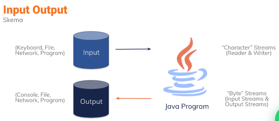

# SUMMARY SECTION 11
# Introduction Basic Programming

Sebelum membahas 3 bagian besar dalam materi Introduction Basic Programming, berikut alasan penggunaan bahasa program java

##### ALASAN PENGGUNAAN BAHASA PROGRAM JAVA
    1. Java memiliki struktur/sytax yang sederhana dibandingkan bahasa pemrograman lain.

    2. Hanya berfokus pada objek,sehingga program komputer dapat saling berinteraksi dengan mudah hanya dengan komunikasi 1 kelompok objek.

    3. Pengamanan yang cukup ketat. Terdapat 3 lapis pengamanan pada Java sebagai pelindung sistem dari penyalahgunaan dari orang-orang yang tidak bertanggung jawab.

    4. Dapat digunakan pada Sytem Operasi manapun. Bahasa pemrograman Java yang dapat digunakan pada tidak terikat ke OS apapun. Hal ini dapat dilakukan karena java merupakan platform independen. Sehingga jika dilajalankan , programa dapat di jalan perangkat manapun.

    5. Menggunakan sistem Exception Handling. Dimana dapat memisahkan antara pengamanan kode kesalahan dan kode normal,sehingga kode program dapat diarahkan structure ke kode program yang lebih bersih,karena jika menemukan kesalahan java akan langsung menemukan Exception. Exception dapat dikelola program tanpa memberikan dampak yang lebih buruk

    6. Mendukung Native Method, dimana native method artinya sebuah fungsi yang ditulis di bahasa lain seperti C dan C++. Dengan adanya native method, memungkinkan programmer menulis fungsi yang bisa dilakukan lebih cepat dibanding yang lain.

    7. Terdapat Garbage Collector. Garbage Collector yang berfungsi untuk mengumpulkan sampah secara otomatis, adanya garbage collector ini programmer tidak perlu dibebani dengan adanya memori yang rusak. 

    8. Daftar Pustaka / Library yang lengkap. 

    9. Terdapat Fitur GUI(Graphical User Interface). 

    10. Penyempurnaan dari dengan C++ (Mirip)

    11. Dapat digunakan di beberapa platform. ”Write once Run everywhere”

# Bagian 1 _ Java Development Kit (JDK)
- Developing
- Debugging
- Monitoring

#### Java Development Kit (JDK)
JDK merupakan komponen inti dari Java. Salah satu tool yang digunakan untuk debugging dan monitoring. Didalam JDK ada JRE (Java Runtime Environtment ) untuk dapat mendukung agar aplikasi java dapat dijalankan.

# Bagian 2 _ Integrated Development Environment (IDE)

#### Integrated Development Environment (IDE)
IDE merupakan tools yang membantu developer untuk membangun suatu aplikasi. Dalam IDE ada source code untuk automation tools dan debugger.
    
Contoh IDE : netbeans,eclipse,intelij,BluJ .

# Bagian 3 _ Basic Programming

## Bagian 3a _ Type Data
Tipe data adalah sebuah pengklasifikasian berdasarkan jenis data tersebut. Tipe data dibutuhkan agar compiler dapat mengetahui bagaimana sebuah data bagaimana digunakan. 

        1. Integer : angka atau bilangan bulat

        2. Char : Tipe data karakter

        3. Float : bilangan desimal kapasitasnya lebih kecil. Menandai nilai yang presisi seperti ketelitian tunggal dengan penyimpanan 32 bit. Tipe ini memiliki kemampuan yang lebih cepat jika di gunakan pada prosesor-prosesor tertentu dan pastinya menggunakan ruang penyimpanan yang lebih kecil daripada float. Kemudian float akan bermasalah jika nlainya terlalu kecil atau terlalu besar.  

        4. Double : bilangan desimal juga, kapasitasnya lebih besar. Memiliki ketelitian tingkat ganda / double presisi dengan penyimpanan 64 bit. Memiliki kemampuan menghitung sistematis secara lebih cepat dari tipe float. Jika ingin menghitung dan hasil lebih real dan akurat gunakan tipe double. 

        5. String : kumpulan dari karakter dengan panjang tertentu dan sering kali dianggap menjadi tipe data DASAR karena tipe paling sering digunakan oleh programmer. 

        6. Char : tipe data untuk menyimpan satu huruf, angka, tanda baca, simbol atau spasi kosong. Biasanya digunakan untuk menyimpan karakter alphabet dengan menampilkan masing-masing karakter menggunakan kode numerik kecil. Jumlah karakter yang ingin disimpan di dalam tipe data Char cukup banyak dan oleh karena itu penggunaan bit harus mewakili setiap karakter secara unik. Penyimpanan karakter ini biasanya disimpan sebagai bilangan bulat tidak bertanda berukuran 8 bit dalam rentang code 0-255. 

        7. Boolean : tipe data yang hanya bernilai true dan false. Penting saat pengambilan suatu keputusan tertentu.

        Contoh Type Data:
        //TipeData.java

        public class TipeData{
            public static void main(String[] args){
                int number = 1;
                float angka = (float) 0.0000009;
                double total = 0.0000000000015;
                String word = "Alterra Academy";
                char huruf = 'a';
                boolean status = false;
            }	
        }

## Bagian 3b _ Operator
Operator digunakan untuk melakukan operasi tertentu misalnya untuk menjumlahkan variabel dll. 

Operator digunakan dalam pemograman  untuk melakukan operasi tertentu.

Beberapa operator dalam java :
#### 1. Operator Assignment (=)
    
    Operator yang digunakan untuk memberikan nilai ke suatu variabel.
    
    //Operator.java
    public class Operator{
    	public static void main(String[] args){
    		String word = "Alterra Academy";
    		
    		System.out.println(alterra[word]);
    	}	
    }
    
    //Hasil nya "Alterra Academy"
    
    Pada code diatas fungsi dari assignment adalah mengassign value dari “alterra acdemy” ke dalam variabel “word”

#### 2. Operator Aritmatika
    
    Operator ini digunakan untuk eksplisit matematika, seperti operasi aljabar dan sebagaimanya. operator yang termasuk ke aritmatika seperti -, x, +, dan : 
    
    //Operator.java
    public class Operator{
    	public static void main(String[] args){
    	
    		int a = 10;
    		int b = 15;
    
    		int sum = a+b;
    
    		System.out.println("Hasil dari penjumlahan : " + sum);
    	}	
    }
    //Hasil nya "25"
    
#### 3. Operator Perbandingan / Relasional dan Quality
    
    Operator membandingkan dua variabel  atau membandingkan dua buah nilai apakah itu sama besar (=),Lebih kecil (<), lebih besar(>) dan hasil nya adalah bolean.

    //Operator.java
    public class Operator{
        public static void main(String[] args){
        
            int a = 10;
            int b = 15;

            boolean result = a > b;

            System.out.println("Hasil dari kondisi : " + result;
        }	
    }
    //Hasil nya "false"

#### 4. Operator Conditional
    
    Operator conditional digunakan untuk  menghasil kan 2 kondisi yaitu “true” atau “false”  dari dua kondisi atau lebih. 
    
    //Operator.java
    public class Operator{
    	public static void main(String[] args){
    	
    		boolean a = true;
    		boolean b = false;
    
    		boolean result = a && b;
    
    		System.out.println("Hasil dari kondisi : " + result;
    	}	
    }
    //Hasil nya "false"

## Bagian 3c _ Input Output

**Input** adalah nilai yang kita masuk kan ke program 

**Proses** adalah step by step yang dilakukan untuk mengelola input menjadi output

**Ouput** adalah hasil dari pengelolahan dari input.

##### 3 Class Untuk Mengambil Inputnya yaitu:
###### 1. Class scanner
    
        Scanner adalah class yang menyediakan fungsi-fungsi untuk mengambil input dari keyboard agar kita bisa melakukan scanner kita perlu mengimport nya ke dalam kode nya dan ada library khusus untuk scanner.
        
        Untuk menggunakan Scanner, kita perlu : 
        
        - membuat objek dari class Scanner, class tersebut berada didalam package *java.util.** 

        - jadi kita perlu menginport packagenya terlebih dahulu,

        - setelah package dan objek selesai dibuat

        - selanjutnya kita membutuhkan sebuah variabel untuk menampung nilai yang di inputkan dari user.

###### 2. Class BufferedReader
    
        Pada bagian ini, kita akan menggunakan class BufferedReader, class tersebut berada di dalam package *java.io*, class ini digunakan untuk mendapatkan input dari user, hampir sama seperti Scanner, yang membedakan hanya cara penulisan syntaxnya saja.

###### 3. Class JOption

        Cara terakhir untuk mendapatkan input dari user adalah dengan menggunakan class JOptionPane calss tersebut terdapat pada package javax.swing. Berbeda dari class sebelunya, JOptionPane memiliki tampilan visual atau GUI untuk memudahkan pengguna, tampilan tersebut berupa dialog box standard yang memfasilitasi kepada user untuk mengkonfirmasi sesuatu.

        Contoh Code InputOutput.java

        import java.util.Scanner;

        public class InputOutput {
            public static void main (String[] args){
                String nama, alamat;
                int usia, gaji;

                Scanner keyboard = new Scanner(System.in);

                System.out.println("### Data Karyawan Alterra");
                System.out.println("Nama : ");
                nama =keyboard.nextLine();
                System.out.println("Alamat : ");
                alamat = keyboard.nextLine();
                System.out.println ("Usia : "); 
                usia = keyboard.nextInt();
                System.out.println("Gaji : " );
                gaji = keyboard.nextInt();
                
                System.out.println("======================");
                System.out.println("Nama karyawan : " + nama);
                System.out.println("Alamat karyawan : " + alamat);
                System.out.println("Gaji : " + gaji);
            }
                
        }

## Bagian 3d _Looping

## Bagian 3e _Branching 
Alur pengeksekusian sebuah kode program alurnya dikerjakan satu per satu dari atas sampai ke bawah baris demi baris dibaca, maka komputer akan membaca satu persatu alurnya.

Alur program :

Branching adalah sebuah istilah yang digunakan untuk menyebut alur program yang bercabang.

Percabangan juga dikenal dengan :
1. Control Flow
2. Structure Condition 
3. Structure IF
4. Decision

Percabangan menggunakan:

1. If 
    - Hanya memilih 1 pilihan

    - IF akan dikerjakan/ dilakukan apabila hanya kondisinya benar saja

    - Jika salah, akan berlanjut ke eksekusi berikutnya

    import java.util.Scanner;
    public class Branching {
        public static void main(String[] args) {
            int belanja = 0;
            Scanner scanner = new Scanner(System.in);
            System.out.println("Total Belanja : ");
            belanja = scanner.nextInt();

            if(belanja > 100000){
                System.out.println("Selamat anda berhak mendapatkan hadiah");
            }
            System.out.println("Terimakasih telah berbelanja");
        }
        
    }

2. Else 
    - Memiliki pilihan alternatif apabila kondisinya salah

    - Jika benar, maka lakukan perintah ini (IF)

    - Jika salah, maka lakukan (else)

    import java.util.Scanner;
    public class Branching {
        public static void main(String[] args) {
            int nilai = 0;
            Scanner scanner = new Scanner(System.in);
            System.out.println("Masukkan nilai : ");
            niali = scanner.nextInt();

            if(belanja >= 70){
                System.out.println("Selamat anda lulus");
            }
                    else {
                    System.out.println("Maaf anda tidak lulus");
                    }
        }
    }

3. Switch 
4. Case

    Percabangan Switch Case adalah bentuk lain dari if else if, perbedaannya adalah percabangan ini menggunakan kata kunci switch dan case. Formatnya berbeda namun cara kerjanya tetap sama.

    import java.util.Scanner;
    public class Branching {
        Public static void main(String[] args) {
            String lampu;
            Scanner scanner = new Scanner(System.In);
            System.out.println(“input warna lampu : “);
            lampu = scanner.nextLine();

            switch (lampu) {
                case “merah”:
                    System.out.println(“ini merupakan lampu merah”);
                    break;
                case “kuning”:
                    System.out.println(“ini sedang lampu kuning”);
                    break;
                case “hijau”:
                    System.out.println(“lampu hijauuuu”);
                    break;
                default:
                    System.out.println(“lampu yang dimasukkan salah”);
            }
        }
    }
