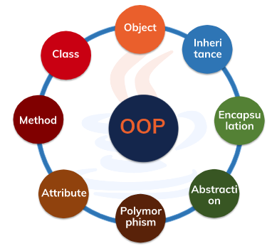
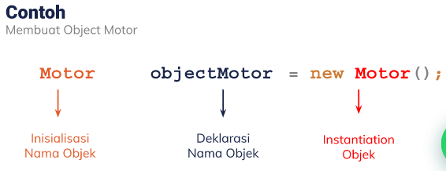
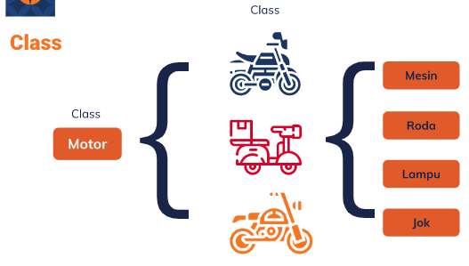
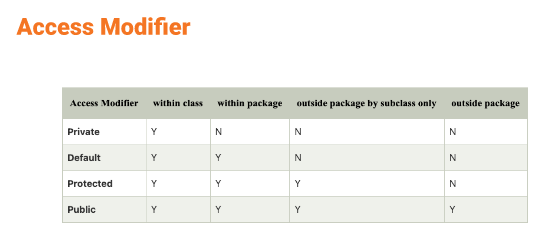

# SUMMARY SECTION 12
# Object Oriented Programming

# Bagian 1 _ Pengertian OOP
OOP merupakan sebuah paradigma teknik pemograman yang fokus atau berorientasi object. Pada OOP, fungsi dan variable dibungkus dalam sebuah objek atau class yang dapat saling berinteraksi, sehingga membentuk sebuah program. 

#### Tujuan OOP :
    1. Mempermudah pengembangan sebuah program yang memiliki fungsi yang dibungkus kedalam object ataupun class.
    2. Meminimalisir program dan membuatnya tertata rapi
    3. Mempercepat pembuatan aplikasi.

# Bagian 2 _ Beberapa Teknik OOP : 
###### 1. Attribute
Atribut (attribute) adalah variabel pada kelas yang menyatakan properti atau karakteristik atau ciri dari suatu obyek. Dalam contoh kelas Animal (binatang) maka atribut dapat berupa name (nama), speed (kecepatan), sound (suara), dsb.

###### 2. Method
- Metode adalah fungsi yang didefinisikan di dalam kelas yang menggambarkan perilaku suatu objek. Setiap metode yang terkandung dalam definisi kelas dimulai dengan referensi ke objek instance.

- Metode di dalam kelas adalah block statement yang memiliki nama dan bisa dieksekusi dengan memanggilnya. Pemanggilan metode biasa disebut dengan “invoke”.

- Dalam contoh kelas Animal (binatang) maka method dapat berupa run (berlari), makeSound (bersuara), dsb.

###### 3. Class
- Class adalah prototype, atau blueprint, atau rancangan yang mendefinisikan variable dan method-methode pada seluruh objek tertentu. Class berfungsi untuk menampung isi dari program yang akan di jalankan, di dalamnya berisi atribut / type data dan method untuk menjalankan suatu program.

- Class merupakan suatu blueprint atau cetakan untuk menciptakan suatu instant dari  object. class juga merupakan grup suatu object dengan kemiripan attributes/properties, behaviour dan relasi ke object lain. Contoh : Class Person, Vehicle, Tree, Fruit dan lain-lain.

###### 4. Object
- Objek adalah instance dari kelas yang dibuat dengan data yang ditentukan secara khusus. Objek dapat sesuai dengan objek dunia nyata atau entitas abstrak. Ketika kelas didefinisikan pada awalnya, deskripsi adalah satu-satunya objek yang didefinisikan.

- Berikut tahapan dalam objek, yaitu:
    1. Declaration : mendeklarasikan nama sebuah obyek
    2. Instantiation : memerlukan sebuah perintah new untuk menciptakan obyek
    3. Initialization : inisialisasi dari sebuah obyek setelah perintah new

###### 5. Inheritance
Inheritance dalam konsep OOP adalah kemampuan untuk membentuk class baru yang memiliki fungsi turunan atau mirip dengan fungsi yang ada sebelumnya. Kelas dapat menggunakan kembali kode dari kelas lain. Hubungan dan subkelas antar objek dapat ditetapkan, memungkinkan pengembang menggunakan kembali logika umum sambil tetap mempertahankan hierarki unik. Properti OOP ini memaksa analisis data yang lebih menyeluruh, mengurangi waktu pengembangan, dan memastikan tingkat akurasi yang lebih tinggi.

Contoh :

###### 6. Encapsulation
Prinsip ini menyatakan bahwa semua informasi penting terkandung di dalam suatu objek dan hanya informasi tertentu yang terpapar. Implementasi dan status setiap objek disimpan secara pribadi di dalam kelas yang ditentukan. Objek lain tidak memiliki akses ke kelas ini atau otoritas untuk membuat perubahan. Mereka hanya dapat memanggil daftar fungsi atau metode publik. Karakteristik penyembunyian data ini memberikan keamanan program yang lebih besar dan menghindari kerusakan data yang tidak diinginkan.

###### 7. Abstraction
Abstraction berarti menyembunyikan detail latar belakang dan hanya mewakili informasi yang diperlukan untuk dunia luar. Ini adalah proses penyederhanaan konsep dunia nyata menjadi komponen yang mutlak diperlukan. Seperti kala menggunakan handphone, kamu cukup memberikan suatu perintah, tanpa tahu bagaimana proses terlaksananya perintah tersebut.

###### 8. Polymorphism
- Polymorphism adalah kemampuan suatu pesan atau data untuk diproses lebih dari satu bentuk. Polymorphism sendiri adalah konsep di mana suatu objek yang berbeda-beda dapat diakses melalui interface yang sama.

- Sebagai contoh, kamu memiliki fungsi untuk menghitung luas suatu benda, sementara benda tersebut berbentuk segitiga, lingkaran, dan persegi yang memiliki rumus perhitungan tersendiri. Dengan polymorphism, dapat memasukkan fungsi perhitungan luas ke tiga benda tersebut, dengan tiap benda memiliki metode perhitungannya sendiri. Ini tentu akan mempermudah perintah yang sama untuk beberapa class atau subclass tertentu.

# Bagian 3 _ Access Modifier :
###### 1. Public (Class, Package, Subclass, Global)
Public : Access modifier public bisa kita sebut sebagai modifier global. Artinya bisa diakses dari manapun bahkan package yang berbeda.
    
###### 2. Default (Class, Package)
Default : Default modifier berarti penulisan kodenya tanpa atribut modifier. Ini berlaku untuk semua kelas, member, atau fungsi yang kita tuliskan tanpa access modifier. Modifier default bisa diakses selama masih dalam satu package.
    
###### 3. Private (Class)
Private : Access modifier private akan membatasi akses hanya di dalam class. Private biasanya digunakan sebagai modifier dari member dan metode suatu class.
    
###### 4. Protected (Class, Package, Subclass)
Protected : Access modifier protected bisa diakses selama masih dalam satu package. Protected memiliki sedikit perbedaan dengan default modifier. Perbedaannya adalah protected bisa diakses dari luar package. Akan tetapi, satu-satunya cara untuk akses dari luar package adalah kelas yang hendak mengakses, merupakan kelas turunannya.

