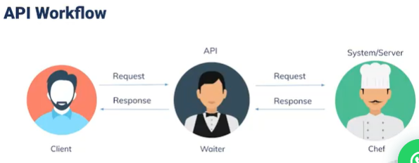

# SUMMARY SECTION 15
# Pengenalan Restful API

## Bagian 1 _ Pengertian API & REST API
##### API (Application Programming Interface) 
Adalah suatu penghubung yang memungkinkan komunikasi dan pertukaran data antara 2 atau lebih software/sistem yang terpisah.

##### Tujuan : 
Untuk mempercepat proses development dengan menyediakan function secara terpisah sehingga developer tidak perlu membuat fitur yang serupa.

***API*** berperan sebagai pembawa pesan yang menerima permintaan dari pengguna dan memberi tahu sistem apa yang harus dilakukan lalu memberikan respon kepada pengguna berdasarkan request tersebut.

##### REST (Representational State Transfer) 
Merupakan standard arsitektur komunikasi berbasis web yg sering digunakan dalam pengembangan aplikasi berbasis web. Umumnya menggunakan HTTP sebagai protocol komunikasi data.

***REST merupakan implementasi*** web service yang digunakan untuk pertukaran data maupun sistem. Dan HTTP juga dapat membatasi hak akses user dalam sebuah data.

#### API Workflow

#### KOMPONEN REST API YAITU 

###### 1. Method-method API
1. Get : membaca data (Read only). (+) Tidak mengubah status data pada server.
    Permintaan ini digunakan untuk mendapatkan sumber daya dari server. Jika melakukan permintaan GET, server mencari data yang Anda minta dan mengirimkannya kembali kepada Anda. Permintaan GET melakukan operasi READ. Ini adalah metode permintaan default.

2. Put : membuat/ mengganti data

3. Post : Membuat data baru
    Permintaan ini digunakan untuk membuat sumber daya baru di server. Jika Anda melakukan permintaan POST, server membuat entri baru dalam database dan memberi tahu Anda apakah pembuatannya berhasil. Dengan kata lain, permintaan POST` melakukan operasi CREATE. Method PUT dan 

4. Delete : Menghapus data yang ada
    Permintaan ini digunakan untuk menghapus sumber daya dari server. Jika melakukan permintaan DELETE, server menghapus entri dalam database dan memberi tahu apakah penghapusan yang dilakukan berhasil. Dengan kata lain, permintaan DELETE melakukan operasi hapus.Header Header digunakan untuk memberikan informasi kepada klien dan server. Header dapat digunakan untuk berbagai tujuan, seperti autentikasi dan memberikan informasi tentang konten isi.URL URL adalah bagaimana Anda mengidentifikasi hal-hal yang ingin Anda operasikan. Kita katakan bahwa setiap URL mengidentifikasi sumber daya. Ini adalah URL yang sama persis yang ditugaskan untuk halaman web.Body Data (terkadang disebut “body” atau “message”) berisi informasi yang ingin Anda kirimkan ke server. Opsi ini hanya digunakan dengan Request POST, PUT, PATCH atau DELETE.

5. Patch 
    Kedua permintaan ini digunakan untuk memperbarui sumber daya di server. Jika Anda melakukan permintaan PUT atau PATCH, server memperbarui entri dalam database dan memberi tahu Anda apakah pembaruan berhasil. Dengan kata lain, permintaan PUT atau PATCH melakukan operasi UPDATE.

###### 2. URL (Base URL + Path)
###### 3. Header 
###### 4. Body
    Berisi parameter yang dikirim ke server. Menentukan parameter yang di save, update atau hapus. 

###### 5. HTTP Response Code
    1. 200 => berarti permintaan telah berhasil (POST & PUT)
    2. 300 => berarti permintaan dialihkan ke URL lain. 
    3. 400 => berarti telah terjadi kesalahan yang berasal dari klien, kesalahan format (POST & PUT). 
    4. 401 => Unauthorized (Tidak melalukan authentikasi terlebih dahulu sebelum melakukan request). 
    5. 404 => Resource Not Found. 
    6. 405 => Method not allowed. (Mis: seharusnya kita memakai method POST namun kita melakukan kesalahn yaitu yang kita pakai adalah method PUT.)
    7. 500 => Ada kesalahan yang terjadi dan berasal dari server.
 

## Bagian 2 _ Testing API
###### API TESTING 
    Yaitu test yang dilakukan pada layer, dimana API yang didesign  untuk berinteraksi dan berkomunikasi dipastikan functional test nya melalui set sebuah tes. Sehingga dapat menggambarkan respon web meskipun GUI belum selesai. 

###### Tujuan API Testing 
    Memperluas cakupan testing itu sendiri dan melakukan test sedini mungkin dimana GUI belum sepenuhnya selesai.

###### Jenis-jenis API Testing
    1. Functionality : memvalidasi suatu fitur apakah sudah berfungsi atau belum.
    2. Load Test : menguji kekuatan sesuatu sistem apakah mampu mengolah data dari beban yang diberikan.
    3. Security : Menguji keamanan untuk suatu sistem.

###### API Testing Tools
    1. Postman
    2. Frisby.js
    3. REST-assured
    4. APACHE-JMeter

###### Unit Test VS API Test
> Unit Test
        1. dilakukan oleh developer
        2. fungsi - fungsi terpisah 
        3. developer bisa mengakses source code
        4. hanya dasar functionality yang ditest
        5. scopenya terbatas
        6. biasanya dilakukan sebelum build
> API Test
        1. Tester perform it
        2. End to end
        3. Tidak bisa mengakses source code
        4. Hanya fungsi API saya
        5. Semua functional issue
        6. Scopenya lebih luas
        7. Dilakukan setelah build.

###### API Testing Process
    1. Spesification Review 
    Mereview spesifikasi API dan use case document
    2. Test Spesification Development 
    Memastikan detail document test condition dan expectation hasilnya di setiap test case
    3. Tes Framework Development 
    Memilih untuk memakai tools apa dalam API testing nanti
    4. Test Case Development 
    Membuat tes scenario dan tes case
    5. Execution & Report 
    Membuat report untuk hasil testing yang sudah dilakukan

###### BEST PRACTICE OF API TESTING
    1. Kelompokkan test case ke dalam beberapa kategori
    2. Beri judul yang sesuai pada setiap test
    3. Harus hati-hati ketika melakukan test yang berhubungan dengan memnghapus sesuatu

###### TYPES OF OUTPUT OF AN API
    1. Bisa berbentuk apa saja, tapi pada umunya JSON atau XML
    2. Status balikan (respinse) apakah passsed atau fail
    3. Memanggil fungsi API lain

###### COMMON TYPES OF TEST IN API TESTING
    1. Memverifikasi apakah kita mendapat respon dari API
    2. Memverifikasi apakah hasil input/request sudah sesuai atau belum
    3. Memverifikasi apakah data yang kita input/update suda benar-benar berubah atau bertambah
    4. Memverifikasi waktu response yang diberikan
    5. Gagal melakukan error handling pada keadaan tertentu
    6. Kesulitan untuk tersambung dan mendapat responAPI
    7. Isu keamanan
    8. Perfomance issue
    9. Error atau warning yang tidak tepat
    10. Struktur dari data respon tidak benar (JSON & XML)

## Bagian 3 _ ADVANTAGES & CHALLENGES OF API TESTING

###### ADVANTAGES OF API TESTING
1. Efisiensi waktu
2. Bahasa yang independen
3. Mengurangi biaya testing
4. Mengurangi resiko

###### CHALLENGES OF API TESTING
1. Kombinasi parameter, pemilihan parameter
2. Tidak ada GUI (Graphical User Interface)
3. Kita harus mengetahu terlebih dahulu parameter
4. Perlu juga mengetest error handling dari setiap API

#### CONCLUSION
API consist of a set of clause/function/procedures which represent the business logic layer. If API is not tested properly, it may cause problems not only the API application, but also in the calling application. It is on indispenable test in software engineering. 