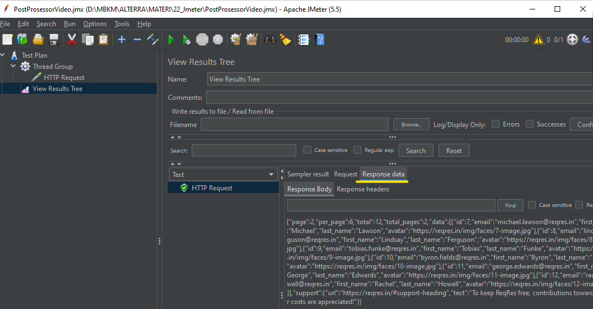
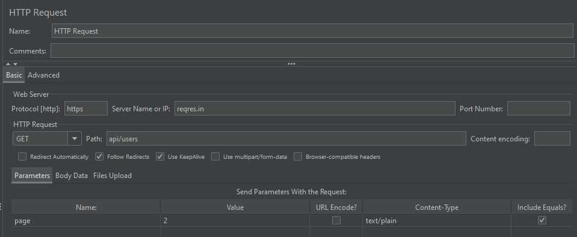
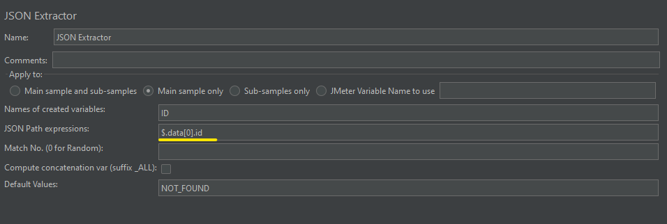
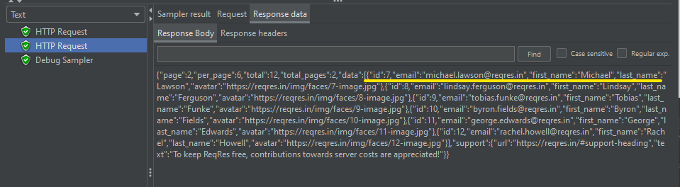
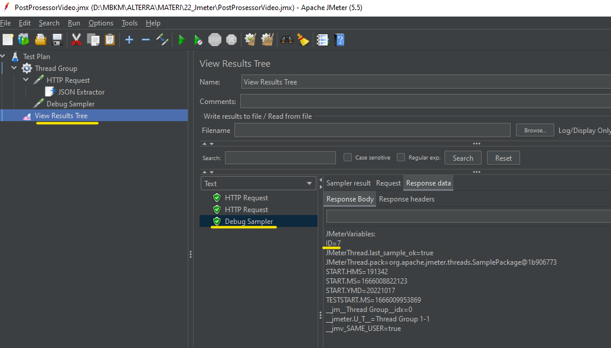
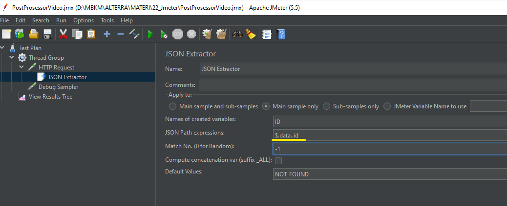
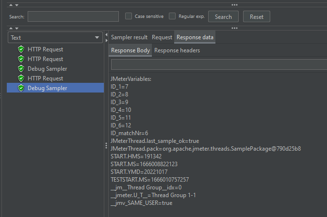
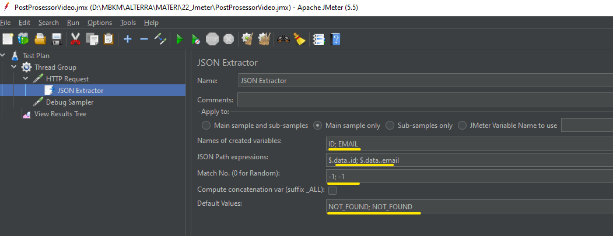
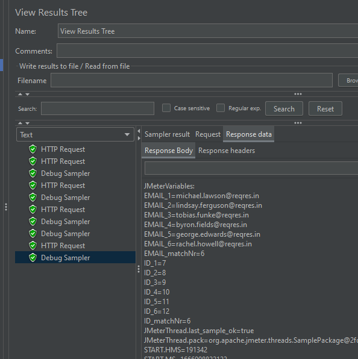

# SUMMARY SECTION 24
# Post Processor

### What is Post Processor ?
The test plan elements that are used to perform certain actions after processing of a sampler request. These post processors are usually used for extracting certain values from the response of a sampler request e.g. we can extract the value of session variables from an HTTP request and pass the session variable’s value to the subsequent request.

### Post Processor : 
Bagian dari test plan yang merupakan sebuah aksi yang berjalan ketika proses setelah dilakukan. Proses request itu sendiri ialah proses request ke suatu alamat web.
    
    Proses request tersebut pada umumnya, mengekstrak value yang didapatkan dari hasil mengakses halaman sebuah web, seperti data-data pada JSON. 
    
    - Post processor yang bisa digunakan di JMeter adalah **JSON Extractor**
    - Di **JSON Extractor** terdapat **Json Path digunakan untuk ekstrak isi dari json response dari** nilai yang terdapat dari data JSON yang dihasilkan dari respons saat kita melakukan request.
    
Berikut susunan kode program yang dihasilkan dari prak di video

### Tujuan POST PROCESSOR
    
Untuk mengolah data yang ada di dalam RESPONSE DATA menggunakan **JSON Extractor.**

### CONTOH 01 MENERAPKAN POST PROCESSOR
Tahap mengolah data yang ada di dalam RESPONSE DATA menggunakan **JSON Extractor:**
1. Buat Terlebih dahulu request GET pada salah satu request di [Reqres] reqres.in

2. Buat JSON Extractor untuk request tersebut dengan cara 
Klik kanan pada “HTTP Request” > ADD > Post Processor > JSON Extractor

3. Buat DEBUG SAMPLER PADA “Http Group” dengan cara
Klik kanan “Thread Group” > ADD > Sampler > Debug Sampler

4. Run kembali dan lihat hasilnya pada DEBUG SAMPLER
NB : terlihat bahwa hasil di DEBUG SAMPLER sesuai dengan isi JSON Extractor yaitu **$.data[0].id (perintah : tampilkan data pertama)** yaitu dengan id=7 jika dilihat dari Hasil HTTP Request

### CONTOH 02 MENERAPKAN POST PROCESSOR
(semua data ID)

JSON Path Expression : $.data..id

Match No : -1

Default Values : NOT_FOUND

Maka resultnya : semua data ID akan ditampilkan di DEBUG SAMPLER

### CONTOH 03 MENERAPKAN POST PROCESSOR
(semua data ID + EMAIL)
JSON Path Expression : $.data..id; $.data..email

Match No : 1; -1

Default Values : NOT_FOUND; NOT_FOUND

Maka resultnya : semua data ID dan EMAIL akan ditampilkan di DEBUG SAMPLER

Hasil di DEBUG SAMPLER: 

### JSON Path
1. Digunakan Untuk extract isi dari JSON Response
2. Beberapa ekspresi yang umum digunakan :
    - $ = Root Element
    - . = Child Operator
    - []= child operator array
    - .. = recursive descent(langsung ke objek)
    - =wildcard(all things) *[ start:end ] = array slice operator borrowed
