# SUMMARY SECTION 25
# Understanding JMeter Result 

#### ===========================================================================================
### Step Open JMeter
1. HTTP Request Defaults : https://reqres.in/
2. Get List Users : /api/user/3 
3. Post User : /api/users
    
    Body Data :
    
    {
    
    “name” : “${nama}”,
    
    “job” : “Student ALTA”
    
    }
    
4. CSV Name file, (uploaded through Zoom chatbox)
5. Response Assertion :
    
    Select Radio Button Response code 
    
    Fill Pattern to test with 201
    
6. Before run your test, please save the test plan save all listener with different name in /desktop/This-is-your-report.jmx
    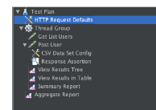

#### ===========================================================================================
### Run Your Test
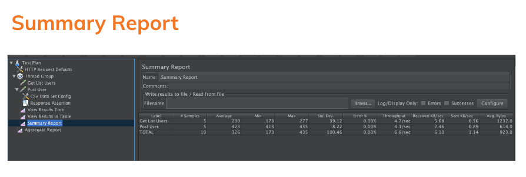
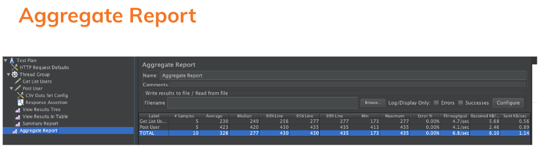
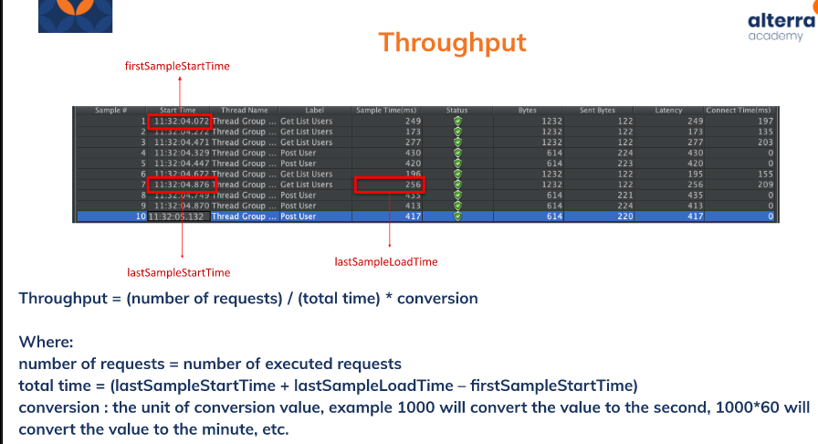

#### ===========================================================================================
### Quick Analyze
Unsur-unsur pada Quick Analyze
1. Case
2. Response Time
3. Throughput
4. Conclude
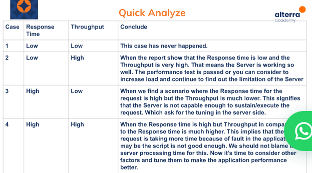

#### ===========================================================================================
### Usage in e-commerce 
1. Know current normal load / capacity

    a. New features added

    b. Just checking :) 

2. Know the capacity on a special event

    a. Usual special event (cth: Lebaran) 

    b. Quick special event

- Apa end point yang biasanya akan dites ?
- Apa alur transaksinya ?
- Apa kendala yang seeing muncul saat performance test ?

#### ===========================================================================================
### Buat Request Baru di Video
Tahap:    
1. Buat request dengan method POST
    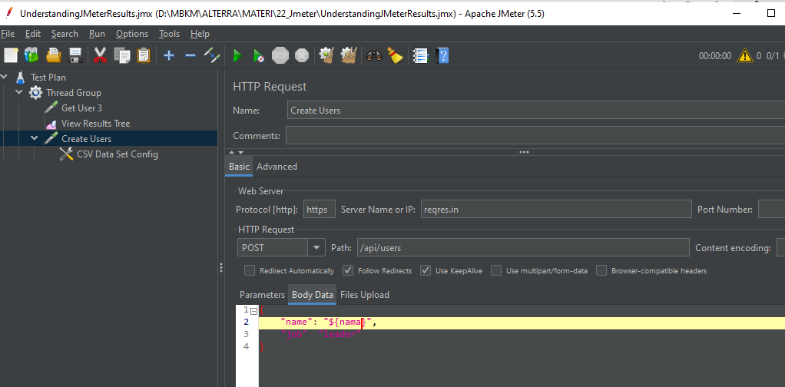

    Dengan name diambil dari CSV dengan cara membuat body data seperti dibawah:
    {
        "name": "${nama}",
        "job": "leader"
    }

2. Cara menghubungkan dengan CSV yaitu tambahkan  CSV Data set config pada Creat Users Request
    
    Step : 
    
    *Klik kanan pada “Create User Request” → Add → Config Element → CSV Data set config*

3. Tambahkan folder CSV mis: datafiles.csv yang akan dihubungkan tadi ke request melalui tombol “Browser”
    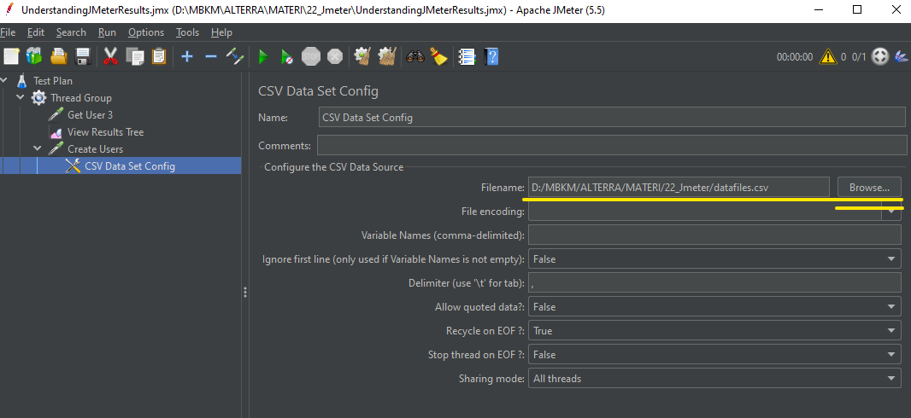

4. Lihat hasil response 
    Dapat dilihat bahwa response : 201 Created
    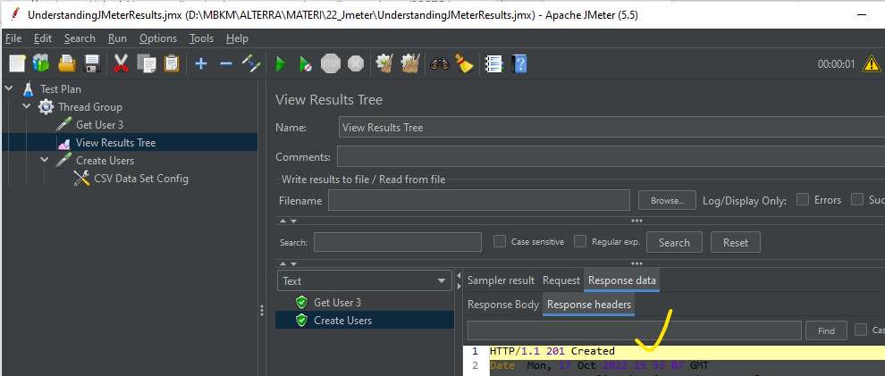

5. Buat assertion untuk memastikan bahwa HEADER RESPONSE : 201 Created
    
    Step: 
    
    *Klik kanan pada “Create User Request” → ADD → Assertion → Response Assertion → Response Code → Input 201 pada Pattern to Test*
    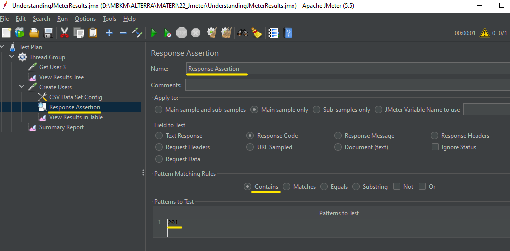

6. Membuat LISTENER untuk melihat hasil di Summary Repost
    
    Step :
    
    *Klik kanan pada “Thread Group” → ADD → Listener → Summary Report*
    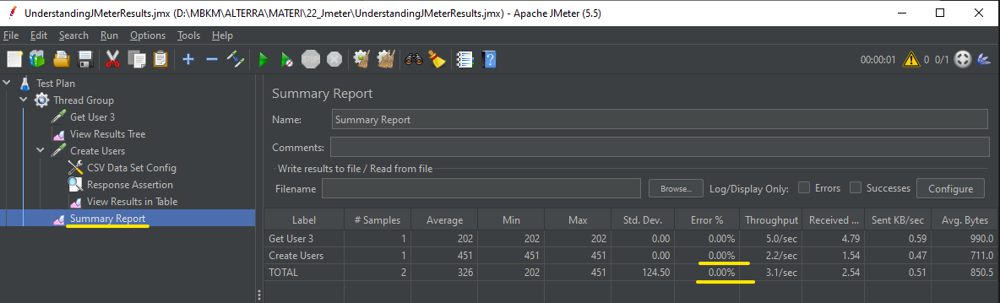

7. Selain itu untuk melihat hasil pada *“Create Users” request* dapat dari View Result in Table
    
    Step :
    
    *Klik kanan pada “Create Users” request→ ADD → Listener → View Result in Table*
    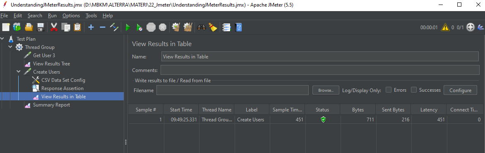

8. Adanya Aggregate fungsi untuk membantu kita dalam menentukan performa dari URL yang kita akses. 
    
    Step membuat Aggregate : 
    
    *Klik kanan pada “Thread Group” → ADD → Listener → Aggregate Report*
    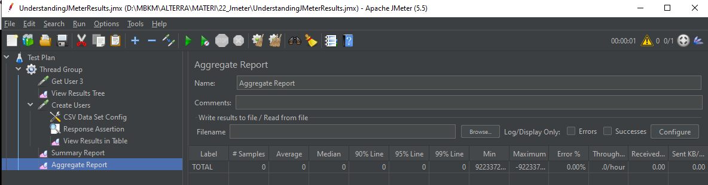

#### ===========================================================================================
### Overview of a Perfomance Test Report
1. Pembahasan Data yang sudah Dimiliki

    a. Summary tentang sistem

    b. Kondisi awal sistem

    c. Target yang ingin dicapai 

2. Data Perfomance Test Yang didapatkan 

    a. Masukkan data dari metrics yang didapatkan

3. Interpretasi Data Performance Test

    a. Interpretasi hasil dari metricsnya

4. Saran
    a. Berikan saran agar sistem lebih baik lagi setelah di tes